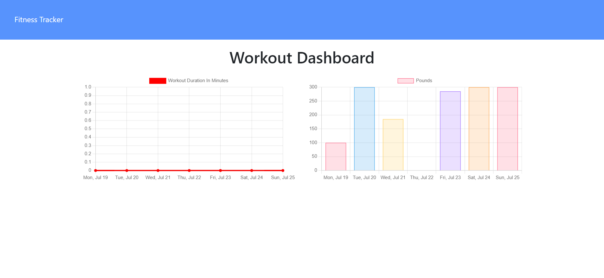
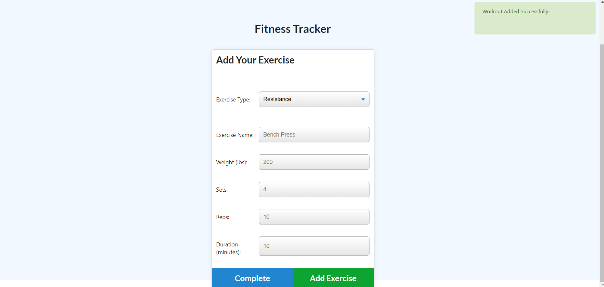

# **Workout Tracker** :weight_lifting_man::bicyclist::running_man:

## Table of Contents

1.  [Description](#description)
2.  [Installation](#installation)
3.  [Project Usage](#Project-Usage)
4.  [License Information](#License-Information)
5.  [Contributors](#Project-Contributors)
6.  [Testing Instructions](#Testing-Instructions)
7.  [Screenshots](#Screenshots)
8.  [Contact Info](#Questions)

## Description

A workout tracker application which allows the user to view, create and track daily workouts (both cardio and weight training sessions with applicable exercises).

The app utilizes Heroku, MonogoDB, Mongoose, Express and Morgan. The workout tracker intakes all user data including weights, sets, reps, and duration then compiles them to a stats page which utilizes charts.js to display the user data over the past 7 workouts. The data is stored and displayed as a card on the dashboard otherwise.

## Installation

The following steps were built out in order to create this functional workout tracker:

_Starter code was provided for this project_

1. Building off the starter code for this web application, an initial **server.js** file was constructed. This file establishes our connection to our Mongoose database and sets up the necessary packages which the workout tracker runs on including: Express, Morgan, Mongoose and requiring our API and HTML Routes.

2. A models folder was created next which includes the **workouts.js** and **index.js** files. The workouts.js is our "Mongoose Schema" for this project. It outlines what will be stored in the Mongoose Database, while intaking the current date. Fields objects collected include exercise type, exercise name, durations, weight, sets and reps. The index.js file is just exporting the workouts.js file.

3. A routes folder was created next to include our **apiRoutes.js** and **htmlRoutes.js** files. The html routes which were built out utilizing express and path to fetch the (3) html pages associated with the workouts. The apiRoutes.js file uses the Mongoose data base and routes via (router.put/get/post) to obtain the user workout data.

_Please note_, these routes were to be built out with "aggregation" via $addFields and $sum. This new functionality proved difficult to get all my routes working correctly, therefore these are still being developed for complete functionality.

## Project Usage

An everyday health and wellness tracker for a user's cardio and weight training workout sessions. Great to view for progress over the past 7 workouts and storing user workout info via a Mongoose Database.

## License Information

The MIT License is a permissive free software license originating at the Massachusetts Institute of Technology in the late 1980s. As a permissive license, it puts only very limited restriction on reuse and has, therefore, high license compatibility.

## Project Contributors

Adam Spiegel

## Testing Instructions

Follow These Steps:

1. If running locally, remember to run npm install, mongod/mongosh, and then connect to localhost:3001.
2. Otherwise, follow the following Heroku Link:

**https://guarded-tundra-05094.herokuapp.com/**

## Screenshots

## Questions?

### Please find my contact information below to reach out!

 
